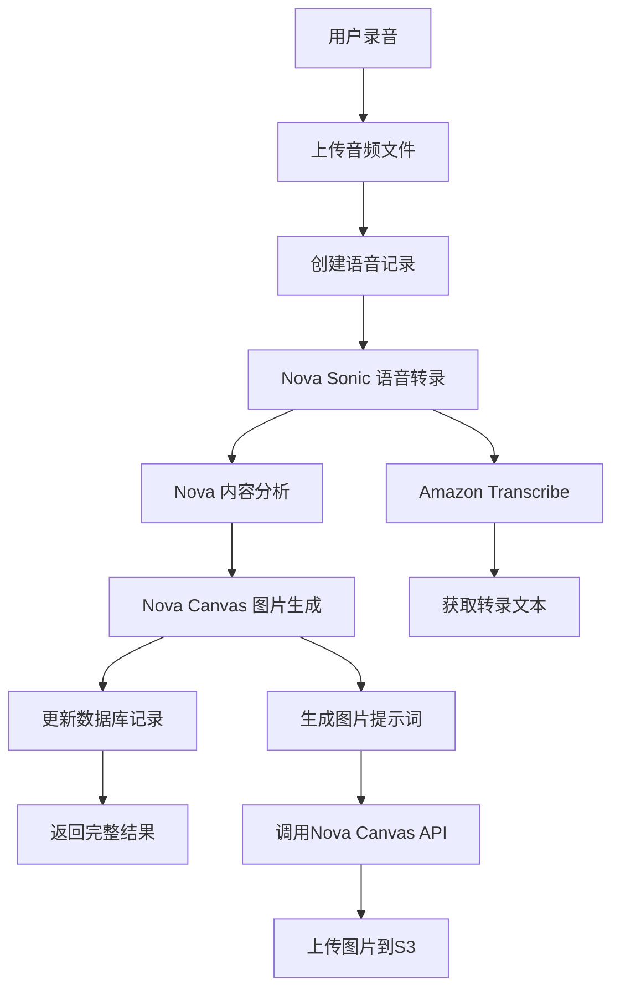

# 🚀 Amazon Nova服务集成指南

## 📋 **集成概述**

Vomage现已集成Amazon Nova Sonic和Nova Canvas服务，提供真实的AI语音处理和图片生成功能。

### 🎯 **服务功能**

1. **Amazon Nova Sonic** - 语音转文字和内容分析
2. **Amazon Nova Canvas** - 基于情感的心情图片生成
3. **Amazon Transcribe** - 高质量语音转录
4. **Amazon S3** - 音频和图片存储

---

## 🔧 **配置步骤**

### 1. **AWS账户准备**

#### 必需的AWS服务权限
```json
{
  "Version": "2012-10-17",
  "Statement": [
    {
      "Effect": "Allow",
      "Action": [
        "bedrock:InvokeModel",
        "transcribe:StartTranscriptionJob",
        "transcribe:GetTranscriptionJob",
        "s3:PutObject",
        "s3:GetObject",
        "s3:PutObjectAcl"
      ],
      "Resource": "*"
    }
  ]
}
```

#### 创建S3存储桶
```bash
# 音频文件存储桶
aws s3 mb s3://vomage-audio-files --region us-east-1

# 生成图片存储桶
aws s3 mb s3://vomage-generated-images --region us-east-1

# 设置公开访问权限（仅图片桶）
aws s3api put-bucket-acl --bucket vomage-generated-images --acl public-read
```

### 2. **环境变量配置**

#### 更新 `.env.production` 文件
```bash
# AWS基础配置
AWS_ACCESS_KEY_ID=YOUR_ACTUAL_ACCESS_KEY
AWS_SECRET_ACCESS_KEY=YOUR_ACTUAL_SECRET_KEY
AWS_REGION=us-east-1
BEDROCK_REGION=us-east-1

# Nova Sonic配置
ENABLE_NOVA_SONIC=true
NOVA_SONIC_MODEL_ID=amazon.nova-lite-v1:0
TRANSCRIBE_LANGUAGE=zh-CN

# Nova Canvas配置
ENABLE_NOVA_CANVAS=true
NOVA_CANVAS_MODEL_ID=amazon.nova-canvas-v1:0
NOVA_IMAGE_QUALITY=premium

# S3存储配置
AWS_S3_AUDIO_BUCKET=vomage-audio-files
AWS_S3_IMAGE_BUCKET=vomage-generated-images

# 备用方案
FALLBACK_TO_LOCAL=true
```

### 3. **服务部署**

#### 重新构建应用
```bash
cd /home/ec2-user/hgy/Vomage
docker-compose down app
docker-compose up -d --build app
```

#### 验证部署
```bash
# 检查服务状态
docker-compose logs app --tail=20

# 测试Nova服务健康
curl https://18.204.35.132:8443/api/nova/health -k
```

---

## 🎯 **API端点**

### 1. **Nova处理API**
```
POST /api/voice/nova-process
Content-Type: multipart/form-data

Body:
- audio: 音频文件 (WebM/MP4)
- context: 上下文信息 (JSON字符串)
```

### 2. **健康检查API**
```
GET /api/nova/health

Response:
{
  "success": true,
  "data": {
    "services": {
      "novaSonic": { "healthy": true },
      "novaCanvas": { "healthy": true }
    },
    "overall": { "healthy": true }
  }
}
```

---

## 🔄 **处理流程**

### 完整的Nova处理流程



### 处理时间预估
- **语音转录**: 30-60秒
- **内容分析**: 5-10秒
- **图片生成**: 10-20秒
- **总处理时间**: 45-90秒

---

## 🎨 **Nova Canvas功能**

### 支持的图片风格
- **Abstract**: 抽象艺术风格
- **Artistic**: 艺术绘画风格
- **Minimalist**: 简约设计风格
- **Realistic**: 写实摄影风格

### 情感到视觉的映射
```typescript
const moodDescriptions = {
  happy: 'bright, joyful, warm colors, uplifting energy',
  calm: 'serene blues and greens, peaceful water, tranquil',
  excited: 'vibrant colors, dynamic movement, celebration',
  thoughtful: 'deep purples and blues, contemplative elements',
  peaceful: 'soft pastels, nature elements, harmony'
};
```

### 图片生成参数
- **尺寸**: 512x512像素
- **质量**: Premium
- **格式**: PNG
- **存储**: Amazon S3公开访问

---

## 🔍 **监控和调试**

### 健康检查
```bash
# 检查Nova服务状态
curl https://18.204.35.132:8443/api/nova/health -k

# 查看详细日志
docker-compose logs app | grep -i nova
```

### 常见问题排查

#### 1. **AWS凭证问题**
```
错误: AWS credentials not configured
解决: 检查 AWS_ACCESS_KEY_ID 和 AWS_SECRET_ACCESS_KEY
```

#### 2. **Bedrock权限问题**
```
错误: Access denied to bedrock:InvokeModel
解决: 确保IAM用户有Bedrock访问权限
```

#### 3. **S3存储桶问题**
```
错误: The specified bucket does not exist
解决: 创建对应的S3存储桶
```

#### 4. **模型不可用**
```
错误: Model not found or not available
解决: 检查模型ID和区域设置
```

---

## 📊 **性能优化**

### 缓存策略
- **转录结果**: 缓存24小时
- **图片生成**: 永久存储到S3
- **健康检查**: 缓存5分钟

### 成本控制
- **按需调用**: 仅在用户录音时调用
- **批量处理**: 支持多风格图片生成
- **备用方案**: 自动降级到本地处理

---

## 🚀 **使用示例**

### 前端调用
```typescript
// 使用Nova服务处理录音
const response = await fetch('/api/voice/nova-process', {
  method: 'POST',
  body: formData, // 包含音频文件
});

const result = await response.json();
console.log('Nova处理结果:', result);
```

### 结果格式
```json
{
  "success": true,
  "data": {
    "id": "voice_record_id",
    "transcript": "转录的语音内容",
    "sentiment": {
      "mood": "happy",
      "confidence": 0.85,
      "details": { "positive": 0.8, "negative": 0.1, "neutral": 0.1 }
    },
    "generatedImage": {
      "url": "https://s3.amazonaws.com/vomage-images/...",
      "style": "abstract",
      "prompt": "生成提示词"
    }
  }
}
```

---

## 🎯 **下一步行动**

### 立即配置
1. **获取AWS凭证**: 创建IAM用户和访问密钥
2. **配置权限**: 设置Bedrock和S3访问权限
3. **创建存储桶**: 建立音频和图片存储
4. **更新环境变量**: 配置真实的AWS凭证
5. **重新部署**: 应用新配置

### 测试验证
1. **健康检查**: 验证所有服务正常
2. **录音测试**: 完整流程测试
3. **结果验证**: 确认转录和图片质量
4. **性能监控**: 观察处理时间和成功率

---

**🎊 Nova服务集成完成，准备提供真实的AI体验！**

**配置文件**: `.env.nova` (包含详细配置说明)  
**健康检查**: `/api/nova/health`  
**处理API**: `/api/voice/nova-process`
